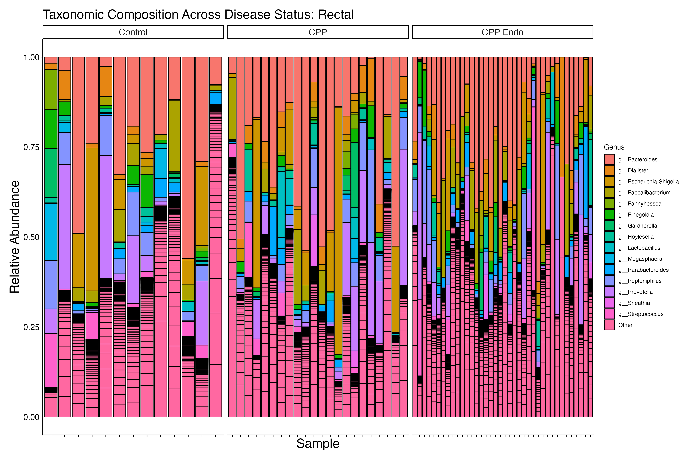
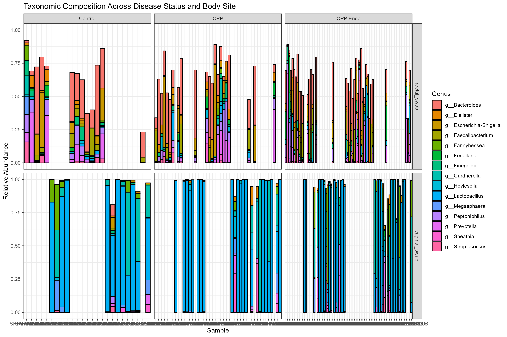
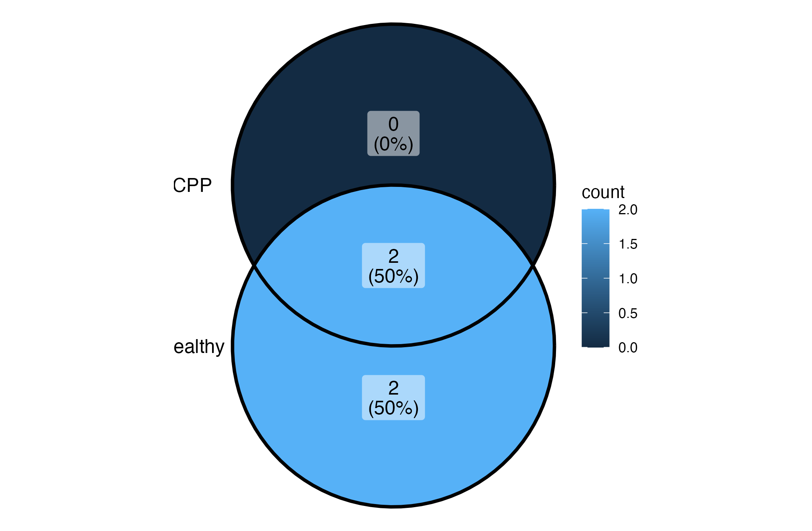
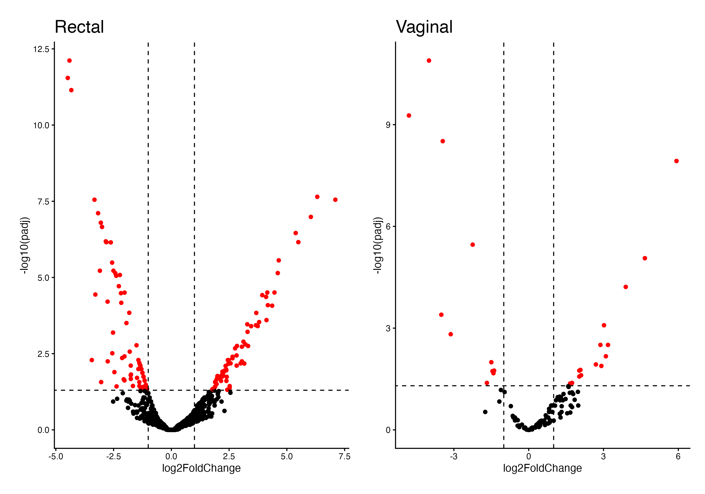
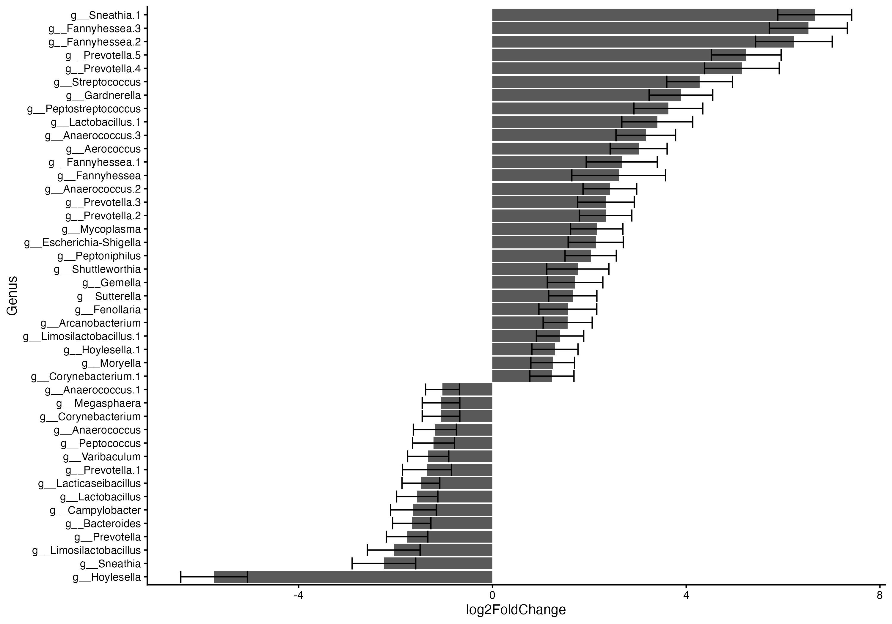

## Updates 

# Meeting 7 - March 9th

## New Plots

### Aim 1

#### Faith PD Boxplot

> Alpha diversity (Faith's PD) compared across disease groups using boxplots

#### Faith PD Violin

> Violin plot of Faith's PD showing the distribution shape of alpha diversity within each group.

#### PCoA

> PCoA ordination (beta diversity) showing separation of samples by disease group

#### PCoA with Ellipse

> Same PCoA with 95% confidence ellipses per group 

---

### Aim 2

#### Taxa Barplot - Rectal

> Taxonomic composition of rectal samples at the genus level, grouped by disease status.

#### Taxa Barplot - Vaginal

> Taxonomic composition of vaginal samples at the genus level, grouped by disease status.

#### Taxa Barplot (Combined)

> Combined taxonomy barplot across both body sites for an overview of community structure.

#### Venn Diagram - CPP Only vs Healthy

> Venn diagram of core microbiome taxa shared and unique between CPP-only and healthy control groups.

#### DESeq Volcano - CPP vs Control

> Volcano plots (rectal & vaginal) of differentially abundant taxa between CPP and Control. Red points pass padj < 0.05 and |log2FC| > 1.

#### DESeq Volcano - CPP Endo vs Control

> Volcano plots (rectal & vaginal) of differentially abundant taxa between CPP Endo and Control.

#### DESeq Volcano - CPP Endo vs CPP

> Volcano plots (rectal & vaginal) of differentially abundant taxa between CPP Endo and CPP-only groups.

#### Significant ASVs - Rectal

> Bar plot of significantly differentially abundant genera in rectal samples (CPP Endo vs CPP), with log2 fold change and standard error.

#### Significant ASVs - Vaginal

> Bar plot of significantly differentially abundant genera in vaginal samples (CPP Endo vs CPP), with log2 fold change and standard error.

