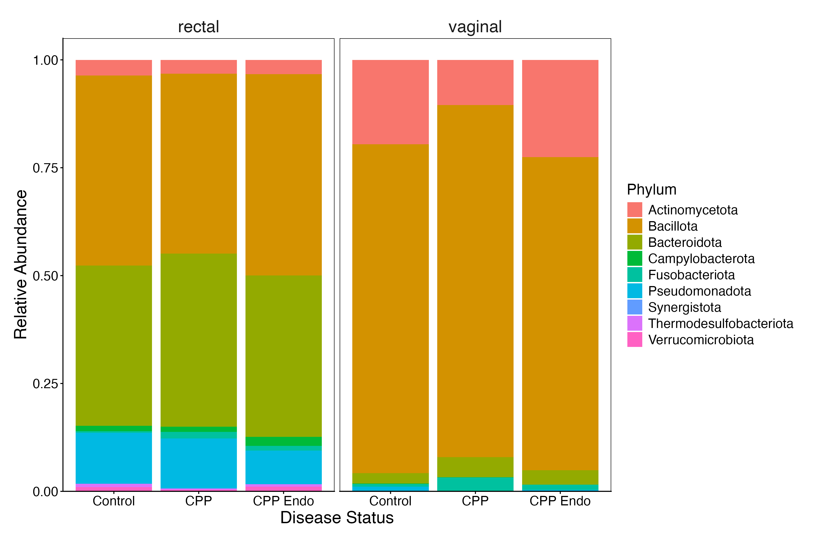

## Major Questions/Updates
- Starting manuscript
- Plots *mostly* finalized
- Consider doing ISA??
    - DESeq gives us 112 (rect) and 22 (vag) significant ASVs (should we consider making threshold more stringent???)
    - Core Microbiome gave us only 1 species in CPP-Endo for rectal and 0 species in vaginal ...

# Meeting 8 - March 16th

## Aim 2 - Phylum Composition
### Added new phylum-level taxonomy composition barplots (used to be genera)

## Aim 2 - DESeq2 Phylum

### Updated DESeq2 differential abundance to phylum level (used to be genera)

## Aim 3 - Volcano Plots
### Aim 3: Made DESeq2 thresholds more stringent for KO differential abundance (log2FC = 4, padj < 0.01)

- currently screening through significant KO terms that are differentially abundant in CPP-Endo/CPP-only contrasts (for vaginal (20) and rectal (9) -> 29 total)
