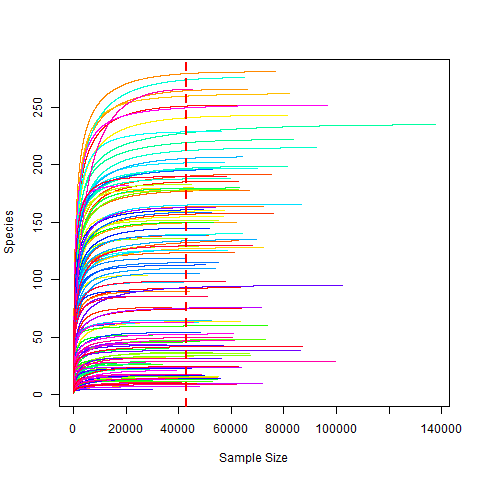
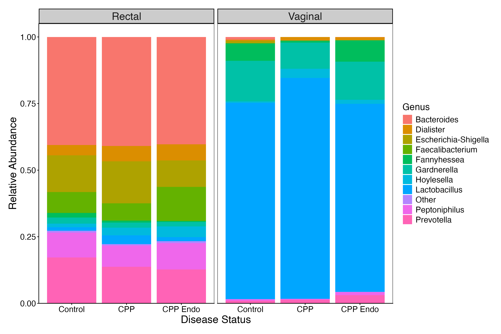
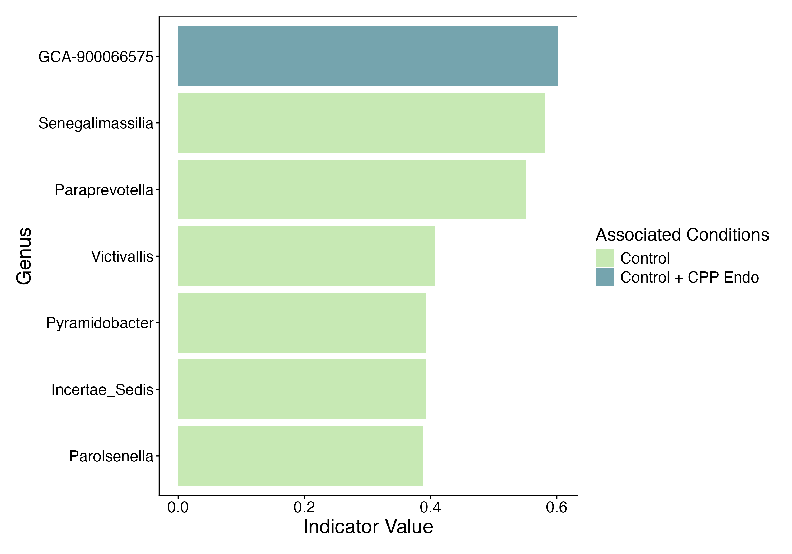
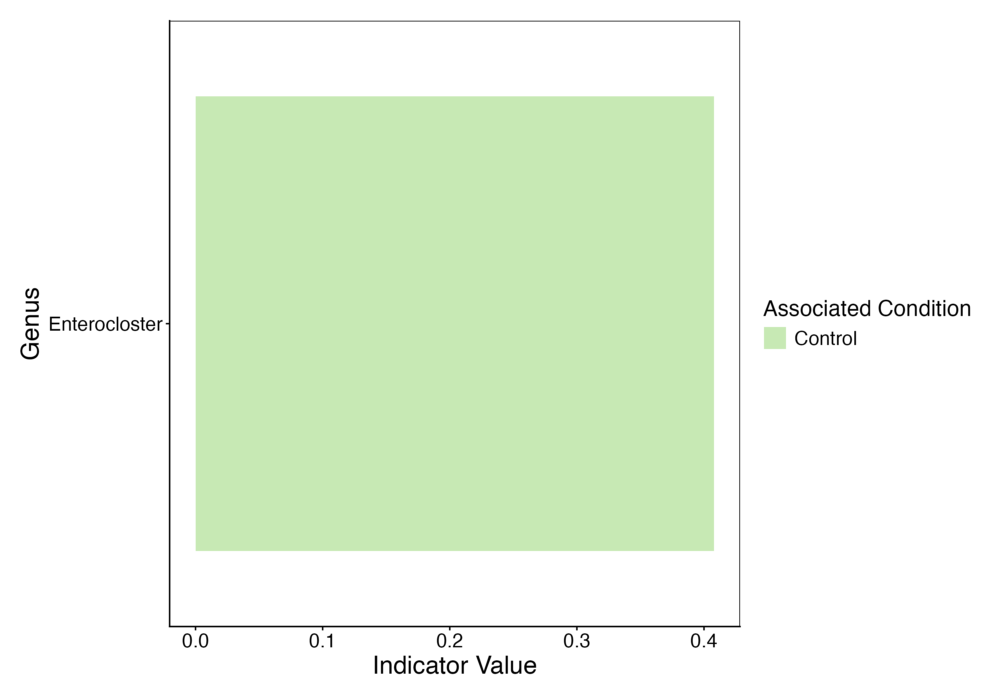
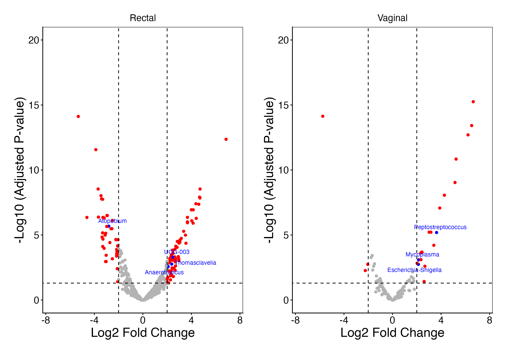
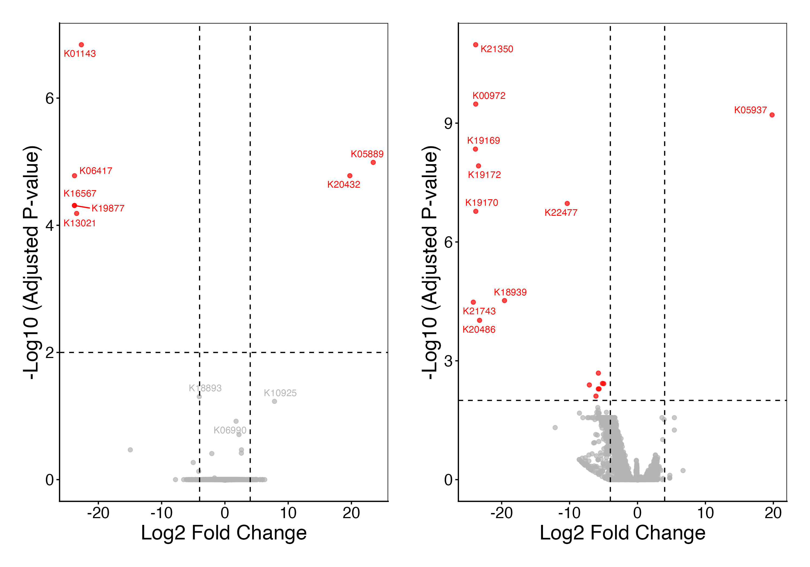
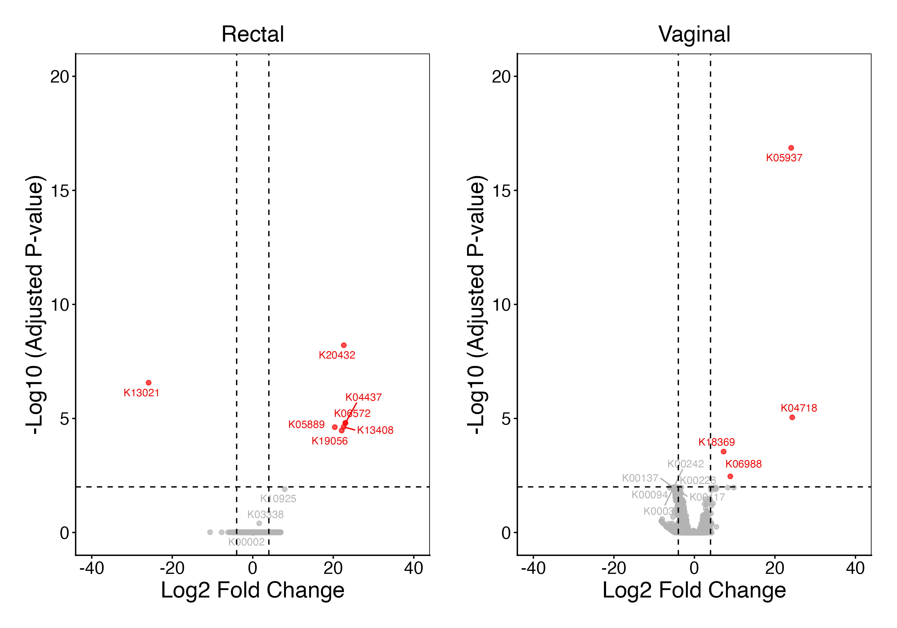
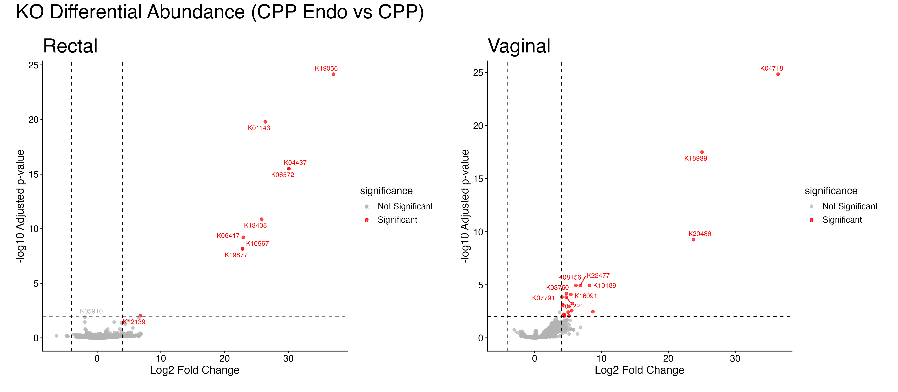
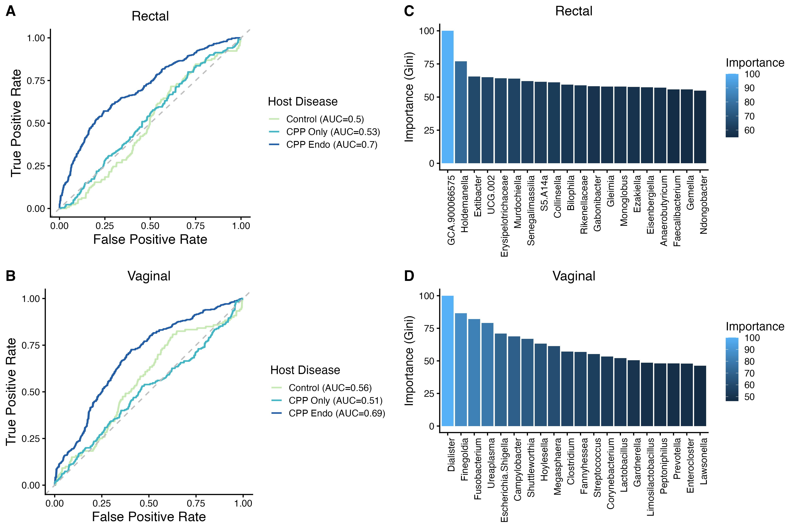
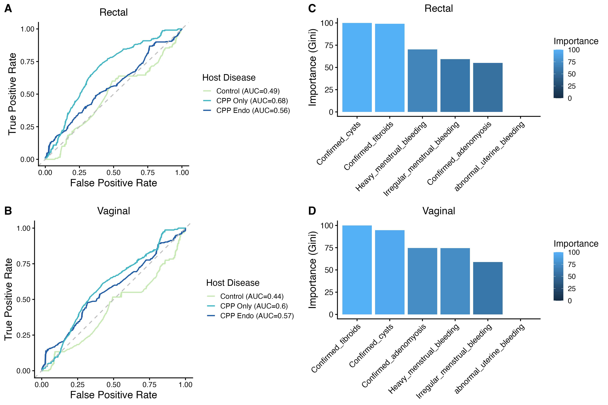

## Introduction

This report contains the methods and results generated throughout the making of this project. Our research question is:

*How does microbial taxonomic and functional diversity differ between CPP patients with and without endometriosis?*

Our aims are:

1. To determine whether microbiome taxonomic diversity differs between CPP patients with and without endometriosis, using healthy controls as a reference baseline, across vaginal and rectal body sites 
2. To identify differentially abundant and core microbial taxa associated with endometriosis among CPP patients, compared to CPP patients without endometriosis and healthy controls 
3. To characterize the predicted functional pathway differences between CPP patients with and without endometriosis using PICRUSt2 

## Methods

### Data processing

The 16S rRNA sequencing dataset was obtained from Jimenez et al.’s manuscript “Vaginal and rectal microbiome contribute to genital inflammation in chronic pelvic pain,” published in 2024 in BMC Medicine. It contains 16S rRNA sequencing data from 146 CPP patients with or without endometriosis as well as healthy controls from both vaginal and rectal samples for each patient. The 16S rRNA was amplified at the V4 region with 515F-806R primers using the Illumina MiSeq benchtop sequencing platform. The metadata also includes information on the other co-symptoms of CPP and endometriosis like cysts, heavy bleeding, and fibroids but will not be relevant in our exploration.  

After importing and demultiplexing the data into QIIME2, we used the DADA2 tool to denoise the dataset based on the data quality of the forward and reverse reads of the paired-end sequences.

| | Before Denoising  | After Denoising   |
|--------|--------|--------|
| Sample size | 146  | 146 |
| Sequencing depth  | 139-151440  |20-137,549|
: Table 1: Total sample size and sequencing depth before and after denoising {.striped .hover}

The phyloseq object was then constructed in R by combining the OTU table, taxonomy table, sample metadata, and phylogenetic tree. Non-bacterial taxa, chloroplast, and mitochondrial sequences were removed, and low-abundance ASVs with fewer than 5 total counts were filtered out. The resulting phyloseq object was saved for downstream analyses.

### Aim 1: Alpha and beta diversity

#### Alpha diversity

Rarefaction curves were generated to determine an appropriate rarefaction depth. Samples were rarefied to a depth of 43,000 reads using `rarefy_even_depth()`. Faith's phylogenetic diversity (PD) was calculated for each sample using the `picante` package. Boxplots and violin plots were generated to visualize Faith's PD across disease groups (Control, CPP, CPP Endo), faceted by body site (rectal vs. vaginal). Kruskal-Wallis tests were used to assess overall group differences within each body site, followed by post-hoc Dunn's tests with Benjamini-Hochberg correction for pairwise comparisons.

#### Beta diversity

Beta diversity was assessed using unweighted UniFrac distances calculated from the rarefied phyloseq object. Principal coordinates analysis (PCoA) was performed and visualized with 95% confidence ellipses, stratified by disease group and body site. PERMANOVA (`adonis2`) was used to test for significant differences in community composition, both overall (testing `env_medium` and `Host_disease` jointly) and stratified by body site.

### Aim 2: Taxonomic composition, core microbiome, and differential abundance

#### Taxonomic composition

Taxonomic composition was explored by transforming filtered counts to relative abundances, agglomerating at the phyla level, and retaining the top 15 genera. Stacked bar plots were generated showing mean relative abundance by disease group, faceted by body site.

#### Core microbiome analysis

Core microbiome analysis was conducted using the `microbiome` package. Samples were stratified by body site (vaginal and rectal) and by disease state (CPP, CPP Endo, Healthy). Core ASVs were identified at a prevalence threshold of 50% across several detection thresholds (0, 0.001, 0.01). Venn diagrams (`ggVennDiagram`) were used to visualize shared and unique core ASVs among Healthy, CPP, and CPP Endo groups for both rectal and vaginal samples.

#### Differential abundance analysis (DESeq2)

Differential abundance analysis was performed using DESeq2. The filtered (non-rarefied) phyloseq object was subset by body site (rectal and vaginal). A pseudocount of 1 was added to all counts to handle zeros. DESeq2 models were fit with `Host_disease` as the design variable. Three pairwise contrasts were tested for each body site:

1. CPP vs. Control
2. CPP Endo vs. Control
3. CPP Endo vs. CPP

Volcano plots were generated for each contrast with significance thresholds of adjusted p-value < 0.05 and |log2 fold change| > 2. Significantly differentially abundant ASVs from the CPP Endo vs. CPP contrast were extracted, annotated with taxonomy, and visualized as bar plots showing log2 fold change by phylum.

#### Indicator Species Analysis (ISA)

Indicator species analysis was performed using ISA and the (indicspecies) package. The fitered (non-rarified) phyloseq object was filtered to the genus level and then filtered by body site (rectal and vaginal swabs). The ASVs were then converted to relative abundance and host disease (CPP, CPP Endo, Healthy) was used as the predictor. The indicator species were filtered for p less than 0.05 and plotted as a bar graph. 

### Aim 3: PICRUSt2 functional profiling

PICRUSt2 was run to predict metagenome functional content (KEGG Orthologs) from the 16S rRNA data. The predicted KO abundance table was split by body site. DESeq2 was used to identify differentially abundant KOs across disease groups. PCA plots were generated to visualize functional profile separation, and volcano plots were created for each pairwise contrast (CPP vs. Control, CPP Endo vs. Control, CPP Endo vs. CPP) for both rectal and vaginal samples, with the top 10 KOs by adjusted p-value labeled.

## Results

### Aim 1: Microbiome diversity

#### Alpha diversity

{#fig-rarefaction}

{#fig-faith-boxplot}

Faith's phylogenetic diversity was substantially higher in rectal samples (median ~12–14) compared to vaginal samples (median ~4–6) across all disease groups (@fig-faith-boxplot). Within each body site, no significant differences in alpha diversity were observed among Control, CPP, and CPP Endo groups (Kruskal-Wallis test, Dunn's post-hoc with Benjamini-Hochberg correction, all pairwise adjusted p > 0.05). This suggests that neither CPP nor endometriosis is associated with a significant loss or gain of phylogenetic diversity at either body site.

#### Beta diversity

{#fig-pcoa}

PCoA of unweighted UniFrac distances revealed a strong separation by body site along Axis 1 (24.7% of variation), with rectal samples forming a tight cluster distinct from vaginal samples (@fig-pcoa). Within body sites, the 95% confidence ellipses for Control, CPP, and CPP Endo groups showed substantial overlap, indicating that microbial community composition does not differ dramatically between disease groups. PERMANOVA confirmed that body site (env_medium) was a significant driver of community structure, while the effect of Host_disease was comparatively modest.

### Aim 2: Taxonomic composition and differential abundance

#### Taxonomic composition

{#fig-taxa-barplot}

The taxonomic composition at the genus level differed markedly between body sites (@fig-taxa-barplot). Vaginal samples were dominated by *Lactobacillus*, consistent with a healthy vaginal microbiome, whereas rectal samples showed a more diverse community dominated by *Bacteroides*, *Prevotella*, and members of the Lachnospiraceae family. Across disease groups within each body site, the overall taxonomic profiles appeared broadly similar at this level of resolution.

#### Core microbiome

::: {layout-ncol=2}
{#fig-venn-rectal}

{#fig-venn-vaginal}
:::

Core microbiome analysis at a detection threshold of 0.001 and 50% prevalence revealed 37 total core ASVs in rectal samples, of which 12 (32%) were shared across all three disease groups (@fig-venn-rectal). The Healthy group had the largest number of unique core ASVs (13, 35%), while CPP Only had 4 unique ASVs (11%) and CPP Endo had only 1 unique core ASV (3%). Six core ASVs (16%) were shared exclusively between Healthy and CPP Endo. In vaginal samples, the core microbiome was much smaller, with only 5 total core ASVs (@fig-venn-vaginal). One ASV was shared across all groups, 2 were unique to Healthy, and no ASVs were unique to CPP Only or CPP Endo alone. The reduced core in CPP groups suggests a loss of consistently present taxa associated with disease.

##### Indicator Species 

{#fig-isa-rectal}

{#fig-isa-vaginal}

Indicator species analysis identified 6 significant indicator taxa in rectal samples (@fig-isa-rectal). Five genera — *Senegalimassilia*, *Paraprevotella*, *Victivallis*, *Pyramidobacter*, and *Incertae_Sedis* — were associated with the Control group, while *GCA-900066575* was associated with both Control and CPP Endo. In vaginal samples (@fig-isa-vaginal), only one indicator taxon was identified: *Enterocloster*, associated with the Control group. Notably, no indicator species were uniquely associated with either the CPP or CPP Endo groups, suggesting that disease states may be more so characterized by the loss of health-associated taxa than by the gain of disease-specific organisms.

#### DESeq2 differential abundance

DESeq2 was used to identify differentially abundant ASVs between disease groups for each body site. Three contrasts were tested: CPP vs. Control, CPP Endo vs. Control, and CPP Endo vs. CPP. Significance was defined as adjusted p-value < 0.05 and |log2 fold change| > 1.

##### CPP vs. Control

{#fig-deseq-cpp-control}

The CPP vs. Control contrast identified 131 significant ASVs in rectal samples and 14 in vaginal samples (@fig-deseq-cpp-control). In rectal samples, differentially abundant ASVs were distributed across both positive and negative log2 fold changes, indicating taxa both enriched and depleted in CPP relative to controls. Vaginal samples showed fewer significant hits, with the most significant ASVs showing large fold changes.

##### CPP Endo vs. Control

{#fig-deseq-endo-control}

The CPP Endo vs. Control contrast identified 89 significant ASVs in rectal samples and 19 in vaginal samples (@fig-deseq-endo-control). In rectal samples, significant ASVs spanned both directions of fold change. In vaginal samples, significant ASVs included both enriched and depleted taxa, with several highly significant hits at large fold changes.

##### CPP Endo vs. CPP

{#fig-deseq-endo-cpp}

The significantly differentially abundant ASVs from the CPP Endo vs. CPP contrast were extracted and annotated with phylum-level taxonomy:

::: {layout-ncol=2}
{#fig-sigASVs-rect}

{#fig-sigASVs-vag}
:::

The CPP Endo vs. CPP contrast identified 112 significant ASVs in rectal samples and 22 in vaginal samples (@fig-deseq-endo-cpp). 7 labeled genera in the rectal volcano plot include *Atopobium*, *UCG-003*, *Thomasclavelia*, and *Anaerofuncus*, while the vaginal plot highlights *Peptostreptococcus*, *Mycoplasma*, and *Escherichia-Shigella* to be uniquely enriched in CPP Endo. These genera are not found to be overlapping in any of the case-control contrasts. The substantially greater number of differentially abundant ASVs in rectal samples across all contrasts suggests that the rectal microbiome may be more broadly impacted by endometriosis-associated dysbiosis than the vaginal microbiome.

In rectal samples, the phylum-level bar plot (@fig-sigASVs-rect) shows differentially abundant ASVs spanning with roughly equal numbers of enriched and depleted taxa. In vaginal samples (@fig-sigASVs-vag), the majority of significant ASVs were enriched in CPP Endo (positive log2 fold change).

### Aim 3: Predicted functional profiling (PICRUSt2)

#### KO abundance PCA

::: {layout-ncol=2}
{#fig-ko-pca-rectal}

{#fig-ko-pca-vaginal}
:::

PCA of predicted KEGG KO abundance showed largely overlapping clusters among disease groups for both body sites. In rectal samples (@fig-ko-pca-rectal), PC1 explained 33.8% and PC2 12.5% of the variation, with all three groups clustering together and no clear separation. In vaginal samples (@fig-ko-pca-vaginal), PC1 explained 40.9% and PC2 17% of the variation, with similarly overlapping ellipses. A few outlier samples were observed in both body sites. Overall, the predicted functional profiles do not show strong global separation between disease groups, suggesting that functional differences may be limited to specific pathways rather than reflecting a broad shift.

Investigating the corresponding KEGG PCA, we observed substantial overlap between disease groups across both body sites, with limited separation between healthy controls, CPP patients, and CPP patients with endometriosis. This suggests a lack of clear global functional differences between groups within the cohort and indicates that overall predicted microbial functional profiles were broadly similar across disease states.

#### Differential KO abundance (volcano plots)

{#fig-vol-vag-cpp-ctrl}

The CPP vs. Control comparison identified 7 significant KOs in rectal samples and 17 in vaginal samples (@fig-vol-vag-cpp-ctrl). In rectal samples, 5 KOs were downregulated (including K01143, K06417, K16567, K19877, K13021) and 2 were upregulated (K05889, K20432) in CPP. In vaginal samples, the majority of significant KOs were downregulated in CPP, with K05937 being the only upregulated KO.

{#fig-vol-vag-endo-ctrl}

The CPP Endo vs. Control comparison identified 7 significant KOs in rectal samples and 4 in vaginal samples (@fig-vol-vag-endo-ctrl). In rectal samples, 6 KOs were upregulated and 1 (K13021) downregulated in CPP Endo. In vaginal samples, all 4 significant KOs (K04718, K05937, K18369, K06988) were upregulated in CPP Endo relative to Controls.

{#fig-vol-vag-endo-cpp}

The CPP Endo vs. CPP comparison yielded the most differentially abundant KOs, with 9 significant KOs in rectal samples and 20 in vaginal samples (@fig-vol-vag-endo-cpp). In rectal samples, all significant KOs showed positive fold changes (enriched in CPP Endo), with the most significant being K04718. In vaginal samples, all 20 significant KOs were also enriched in CPP Endo, including K03760, K07221, K08156, K10189, and K16091 among the top hits. The substantially larger number of differentially abundant KOs in this contrast, particularly in vaginal samples, suggests that endometriosis is associated with distinct functional pathway enrichment beyond the baseline CPP-associated changes.

Despite the overall similarity in predicted functional profiles across disease groups, we observed separation at the KEGG ortholog level between healthy controls, CPP-only patients, and CPP patients with endometriosis at both rectal and vaginal sampling sites. Compared with controls, both CPP-associated groups (CPP only and CPP Endo) showed differences in the abundance of multiple KEGG orthologs, including both enriched and depleted functions. When comparing CPP Endo specifically to controls, several uniquely enriched KEGG orthologs were identified, particularly at the vaginal site. Notably, a greater number of significant functional differences were observed in vaginal samples compared with rectal samples, which may reflect site-specific microbial community structure and functional adaptation within the reproductive tract environment.

### Random Forest Classification: Microbiome and Metadata Predictive Models

We evaluated the ability of both microbial taxa abundance and clinical metadata to predict Host_disease status (Control, CPP Only, CPP Endo) using random forest models, separately for rectal and vaginal samples.

#### Microbiome-only models

The microbiome-based models showed poor predictive performance, with all AUC values below 0.7 for both rectal and vaginal samples. Feature importance analysis revealed that no single taxon dominated the model, with Fusobacterium among the top contributors.

#### Metadata-only models

Models using only clinical metadata (e.g., bleeding, cysts, fibroids) also performed poorly, with AUC values below 0.7. No metadata variable showed strong predictive power for distinguishing CPP Endo from other groups.

These results indicate that neither the microbiome nor clinical metadata alone are strong predictors of CPP Endo status in this cohort.
